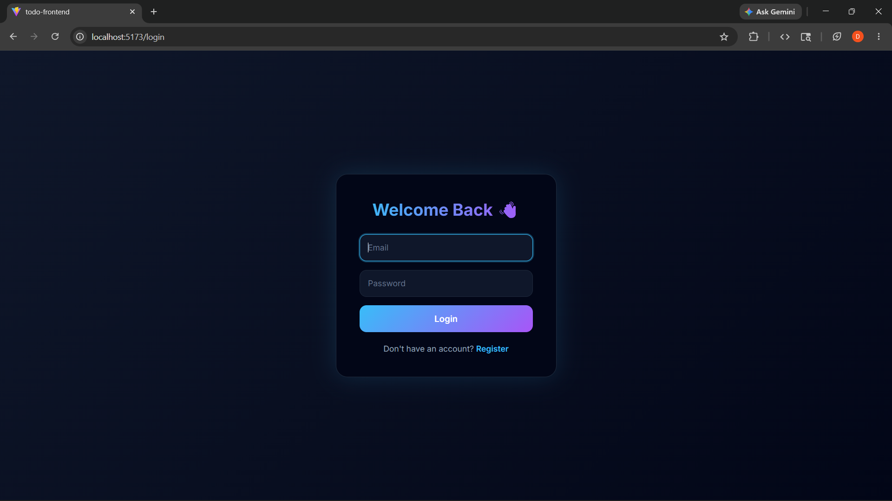
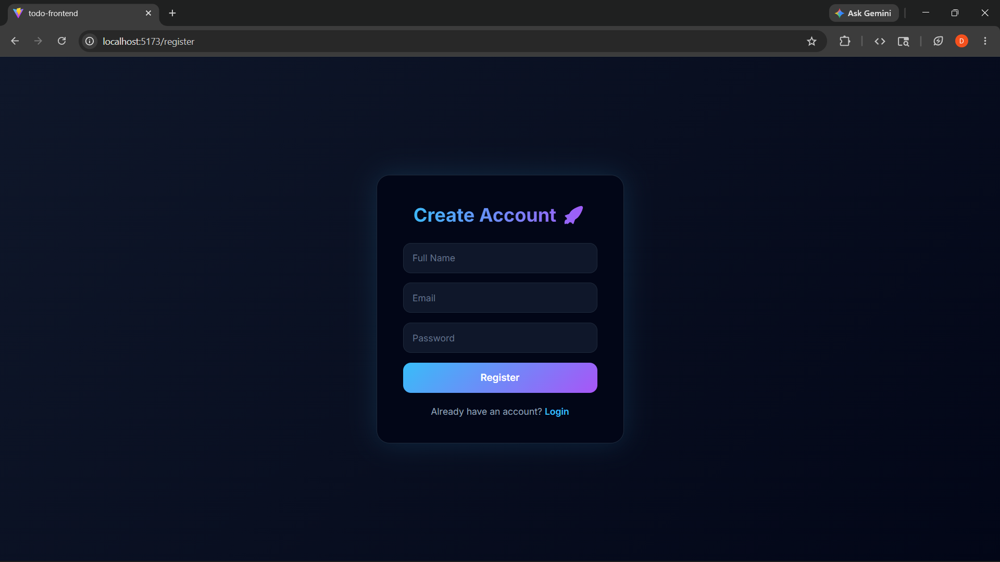
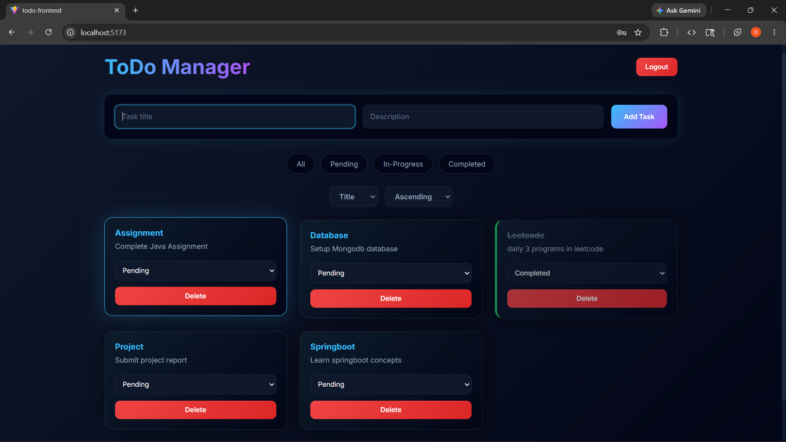

# Todo List App

A full-stack todo management application with user authentication and task tracking. Built using React.js and CSS3 on the frontend and Node.js, Express.js with MongoDB on the backend.


## Demo

▶️ [Watch Demo Video](https://drive.google.com/file/d/1h9hGEKNWwsKvo5RqAeuN4kwqHtdYMiR6/view?usp=sharing)


## Tech Stack

- **Frontend:** React.js, CSS3
- **Backend:** Node.js, Express.js
- **Database:** MongoDB (Mongoose)
- **Authentication:** JWT (JSON Web Token)

## Features

- User registration and login with JWT authentication
- Add, delete, and update tasks
- Filter tasks by status — All, Pending, In-Progress, Completed
- Sort tasks by date, title, or status
- Pagination for task list
- Responsive design for mobile and desktop
- Animated task cards with slide-in effects
- Dark theme UI with gradient styling

## Screenshots

### Login



### Register



### Tasks


## Project Structure

```
todo-list/
├── todo-frontend/
│   ├── src/
│   │   ├── pages/
│   │   │   ├── Login.jsx
│   │   │   ├── Register.jsx
│   │   │   └── Tasks.jsx
│   │   ├── api/
│   │   ├── App.jsx
│   │   ├── App.css
│   │   ├── Auth.css
│   │   └── Tasks.css
│   └── package.json
└── todo-backend/
    ├── controllers/
    ├── models/
    ├── routes/
    ├── server.js
    └── .env
```

## Run Locally

### Prerequisites
- Node.js installed
- MongoDB installed and running

### Backend Setup

```bash
cd todo-backend
npm install
```

Create a `.env` file inside `todo-backend/`:

```env
PORT=5000
MONGO_URI=your_mongodb_connection_string
JWT_SECRET=your_jwt_secret_key
```

Start the backend:

```bash
node server.js
```

### Frontend Setup

```bash
cd todo-frontend
npm install
npm run dev
```

Open `http://localhost:5173` in your browser.

## Author

dharu-dharanic  
[GitHub Profile](https://github.com/dharu-dharanic)